# HaniMandlWroom/Hardware/Gehäuse
HaniMandel für das Node MCU ESP32 38Pin Evaluation Board
## Was findet man in diesem Ordner
In diesem Ordner findet man alles was man braucht, um das Gehäuse und die Waage mir einem 3D-Drucker zu erstellen.

# 3D Bilder
## Gehäuse HaniMandl
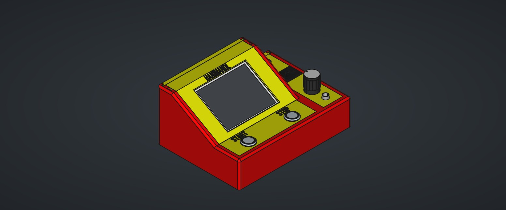
## Gehäuse Waage

# Einzelteile Gehäuse Hanimandl
## Body (Filename: Bottom)
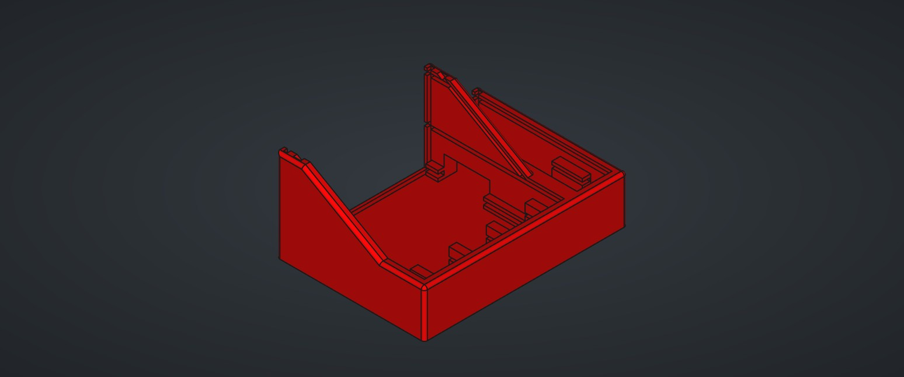
## Start/Stop Taster (Filename: Button)
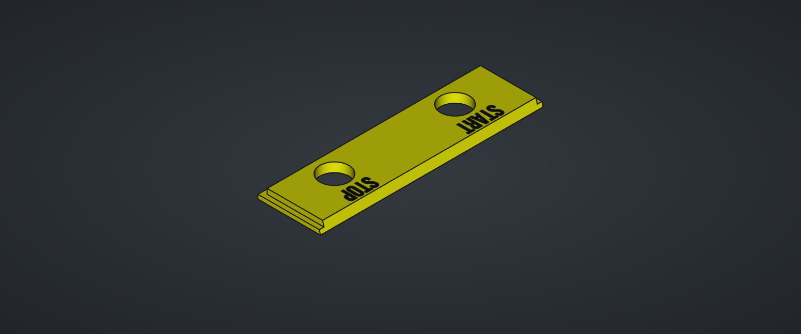
## Display (Filename: Display_OLED)
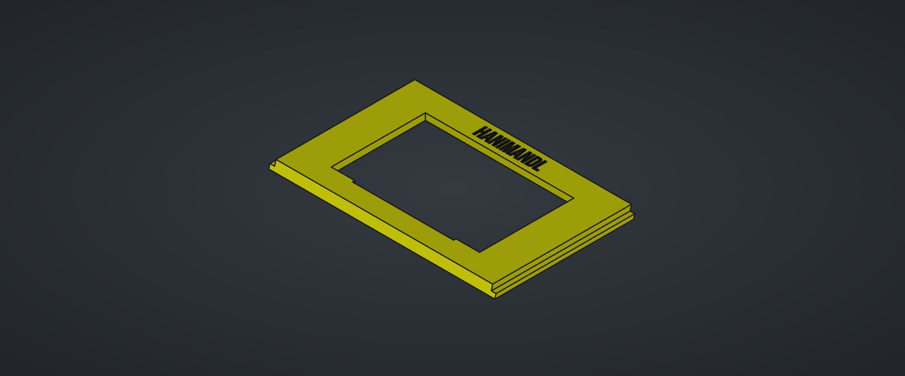
## Display 2.8TFT (Filename: Display_TFT)
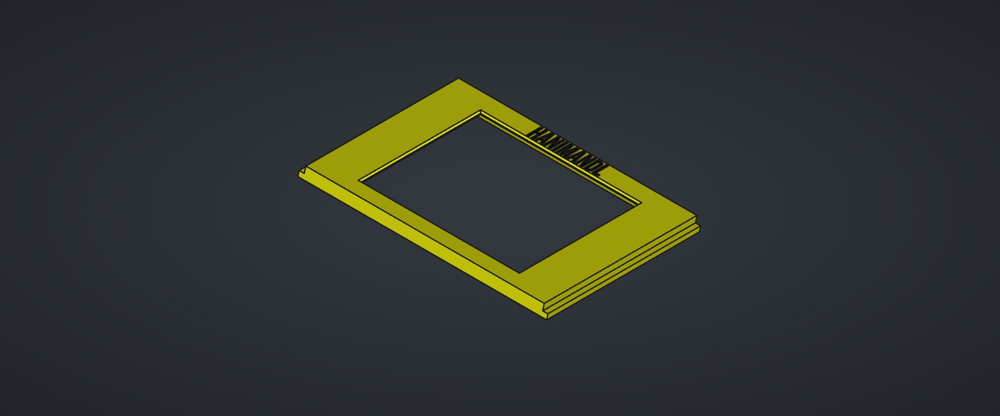
## Deckel top klein (Filename: Top)
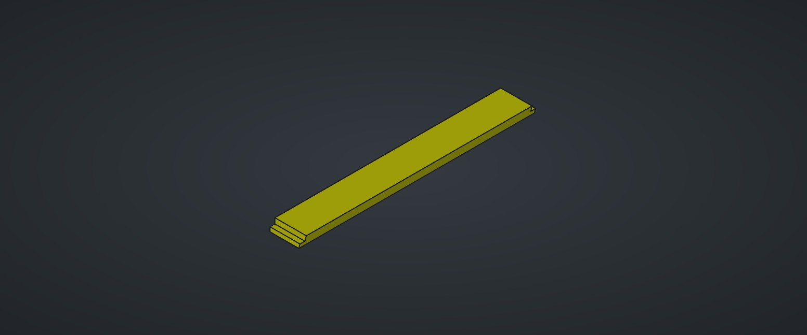
## Deckel Bedienelemente (Filename: Rotary)
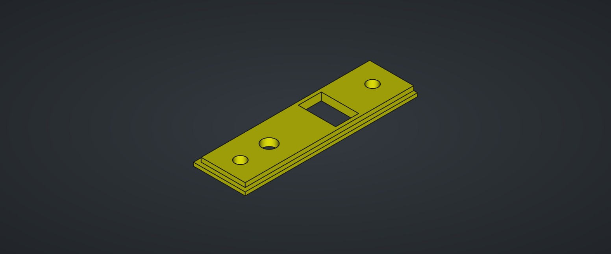
## Deckel Rückseite Bedienelemente (Filename: Back_Small)
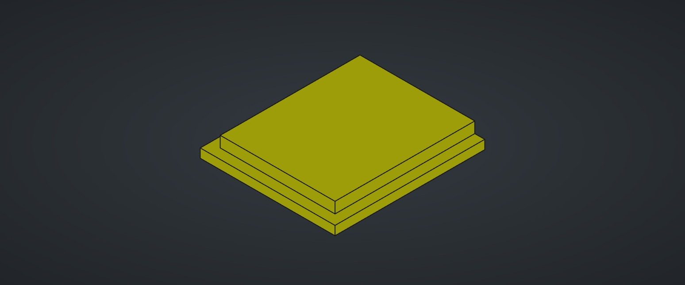
## Deckel Rückseite Display oben (Filename: Back_Big_2)
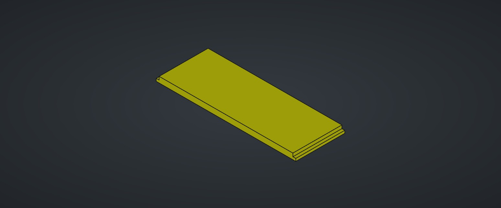
## Deckel Rückseite Display unten ohne USB (Filename: Back_Big_1)
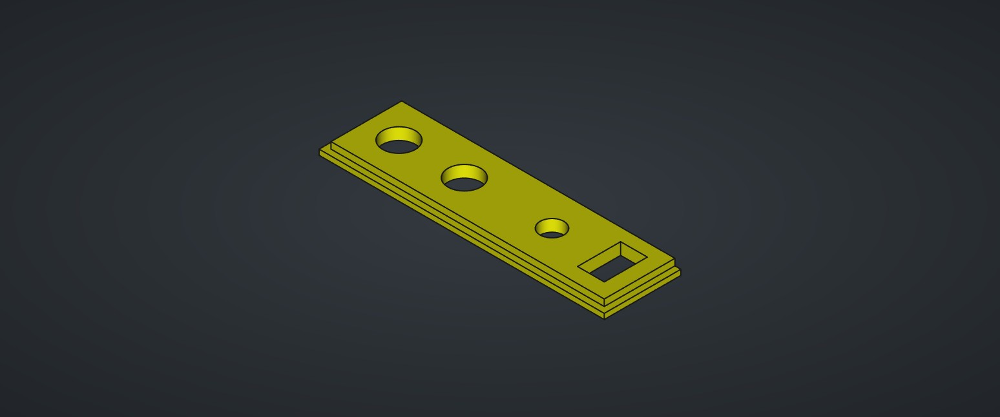
## Deckel Rückseite Display unten mit USB (Filename: Back_Big_1_USB)
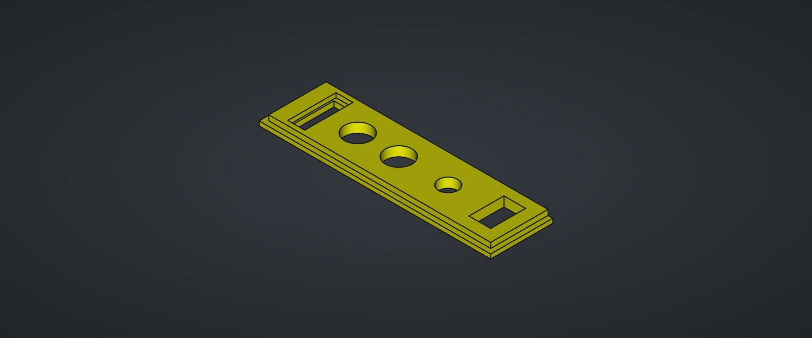

# Einzelteile Gehäuse Waage
## Waage oben (Filename: Waage_Top)

## Waage unten (Filename: Waage_Bottom)

