# HaniMandlWroom/Hardware/Gehäuse
HaniMandel für das Node MCU ESP32 38Pin Evaluation Board
## Was findet man in diesem Ordner
In diesem Ordner findet man alles was man braucht, um das Gehäuse und die Waage mir einem 3D-Drucker zu erstellen.
## Link zu dem 3D Projekt
[Gehäuse und Waage](https://cad.onshape.com/documents/ed8334b01f82a8780d092716/w/744a4c21bb70565fea26ff45/e/c054f225e62c57c52ba056c9)

# 3D Bilder
## Gehäuse HaniMandl
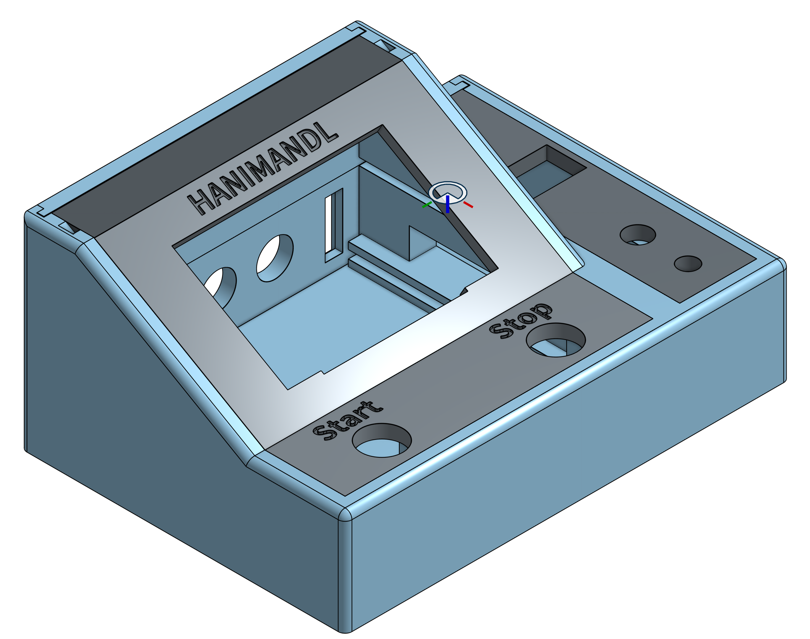
## Gehäuse Waage
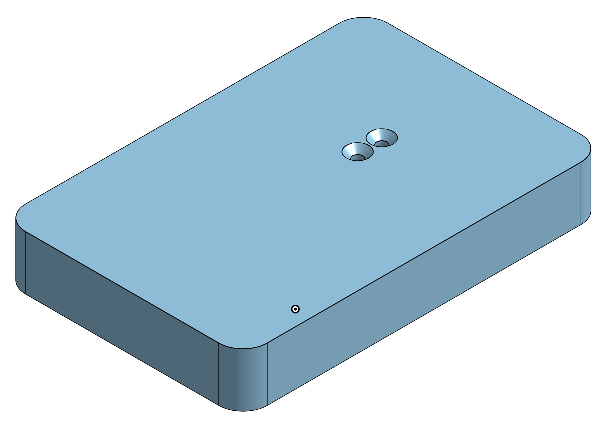

# Einzelteile Gehäuse Hanimandl
## Body (Filename: Bottom)
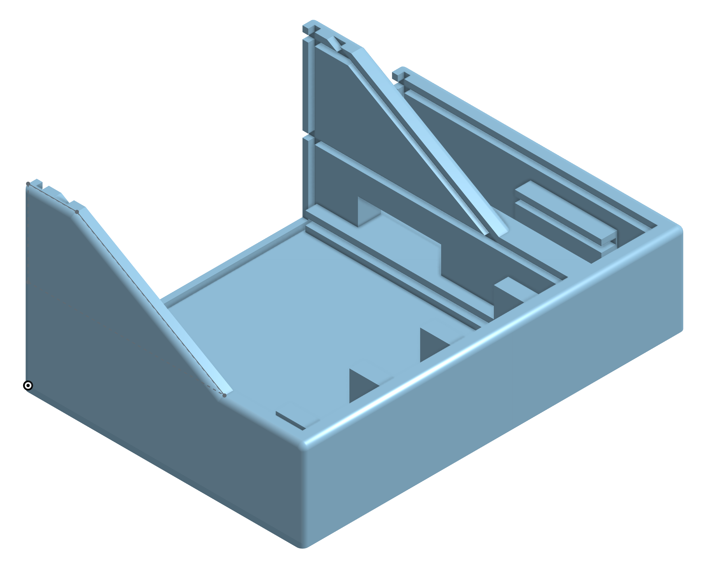
## Start/Stop Taster (Filename: Deckel_Front)
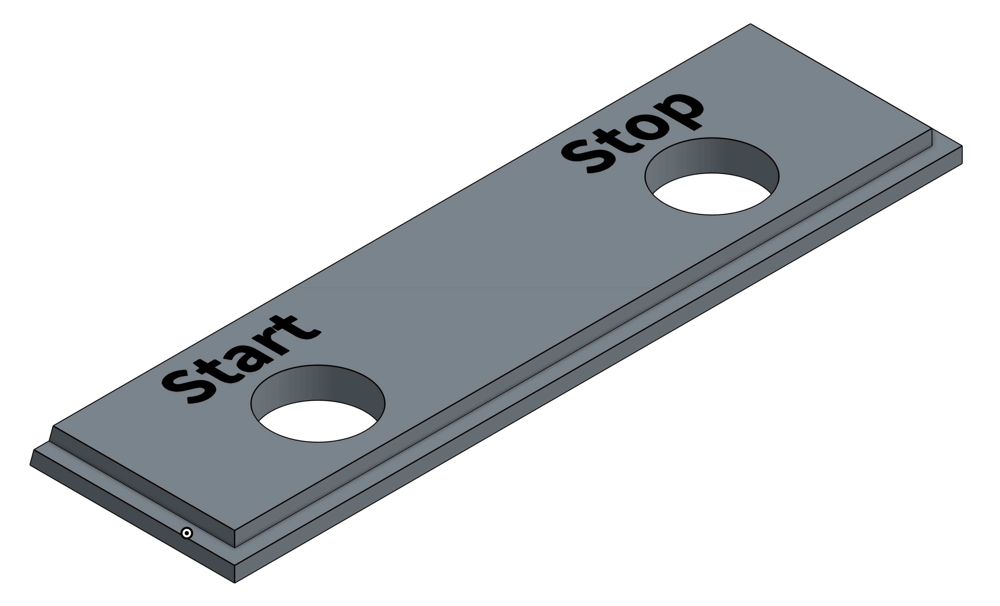
## Display (Filename: Deckel_Display)
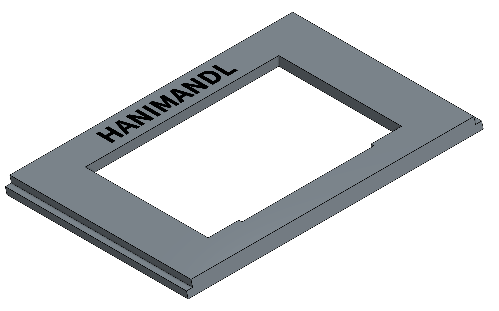
## Deckel top klein (Filename: Deckel_Back)
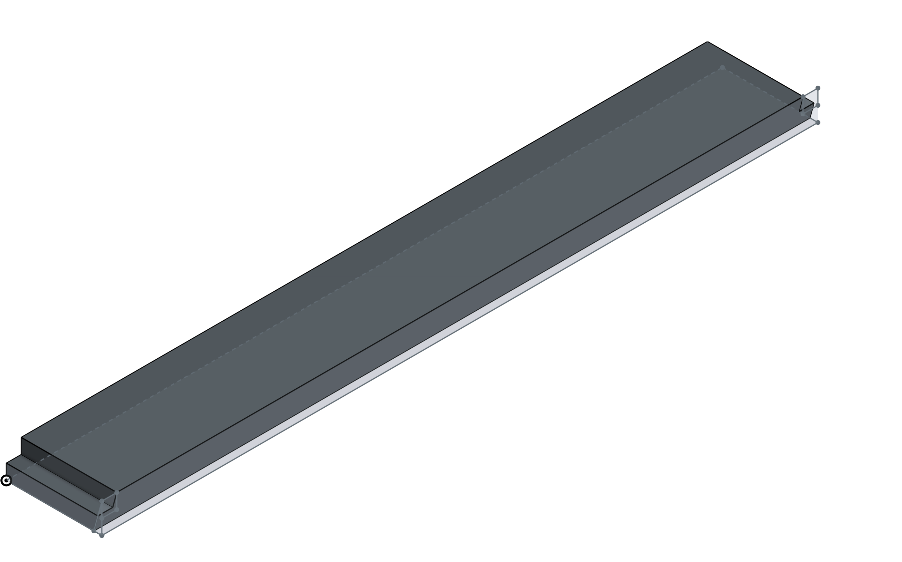
## Deckel Bedienelemente (Filename: Deckel_Rechts)
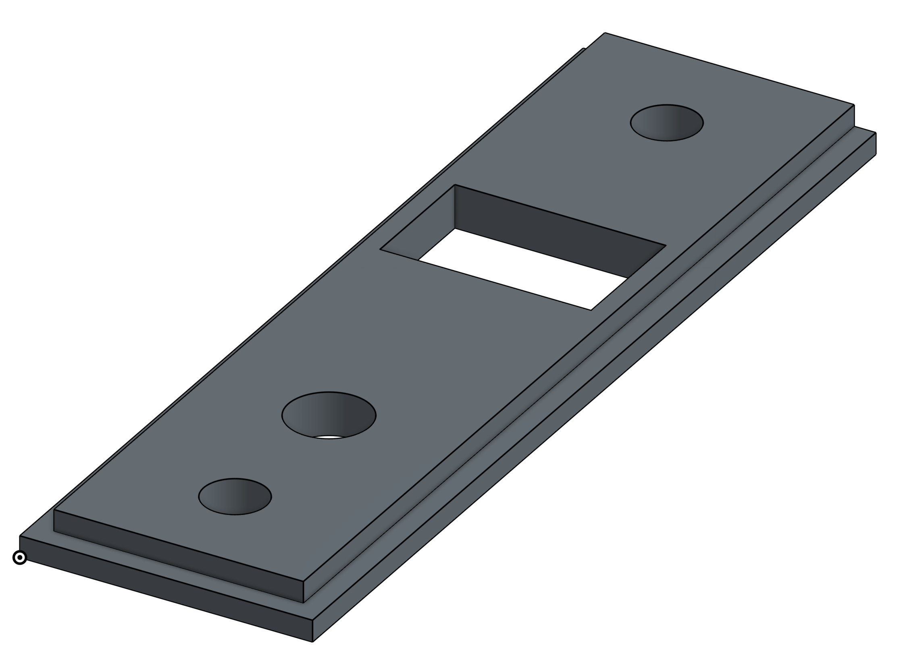
## Deckel Rückseite Bedienelemente (Filename: Gehause_Back_Klein)
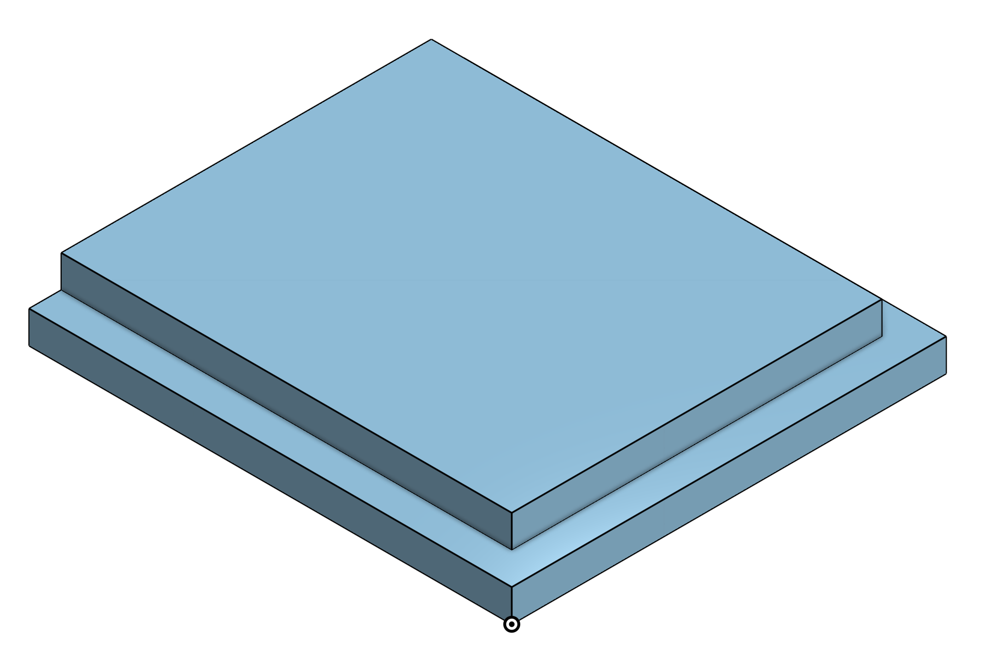
## Deckel Rückseite Display oben (Filename: /Gehause_Back_Gross_2)
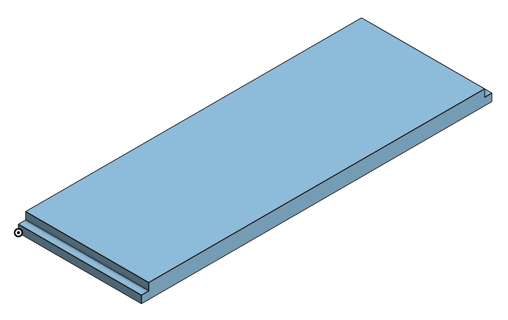
## Deckel Rückseite Display unten ohne USB (Filename: /Gehause_Back_Gross_1)
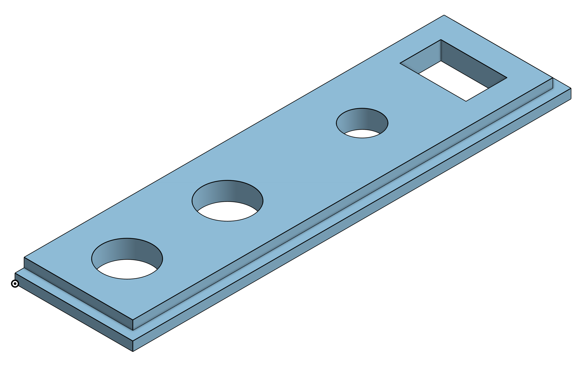
## Deckel Rückseite Display unten mit USB (Filename: /Gehause_Back_Gross_1_USB)
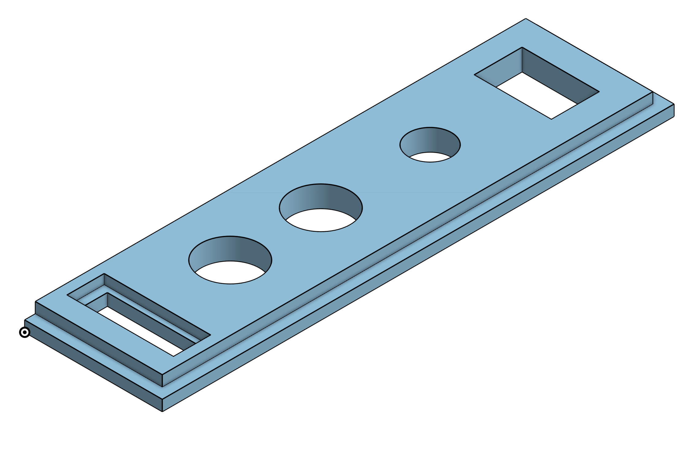

# Einzelteile Gehäuse Waage
## Waage oben (Filename: Waage_Top)
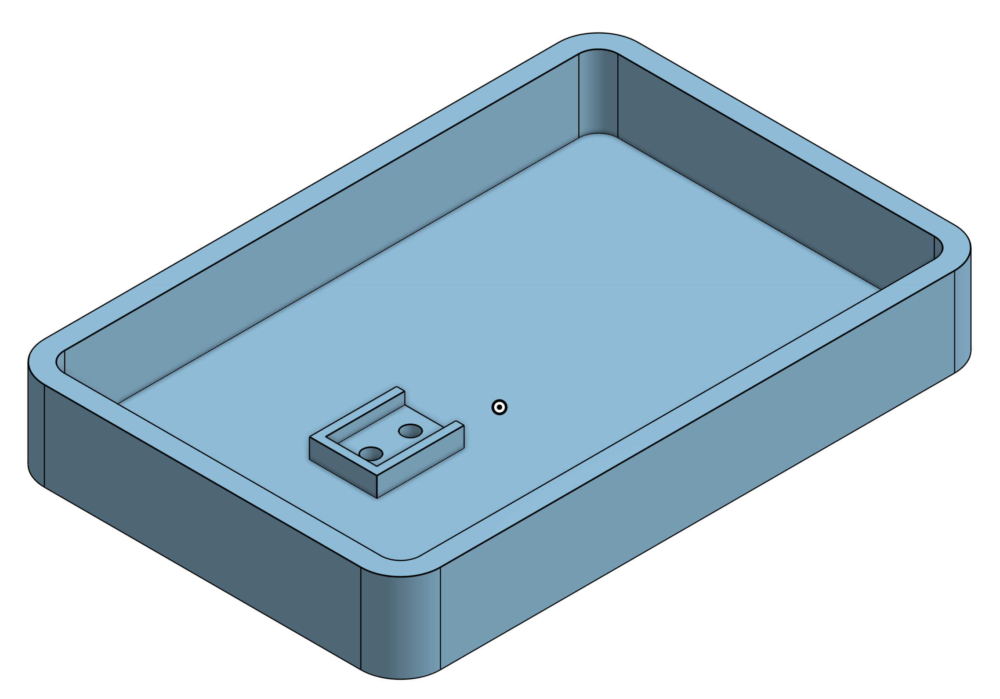
## Waage unten (Filename: Waage_Bottom)
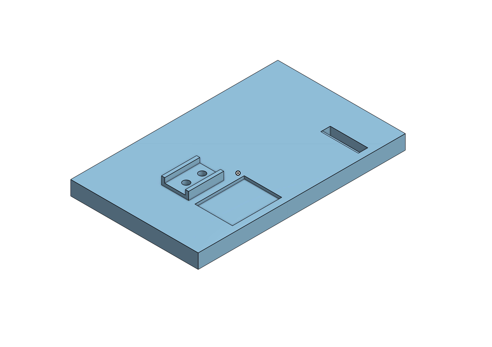
