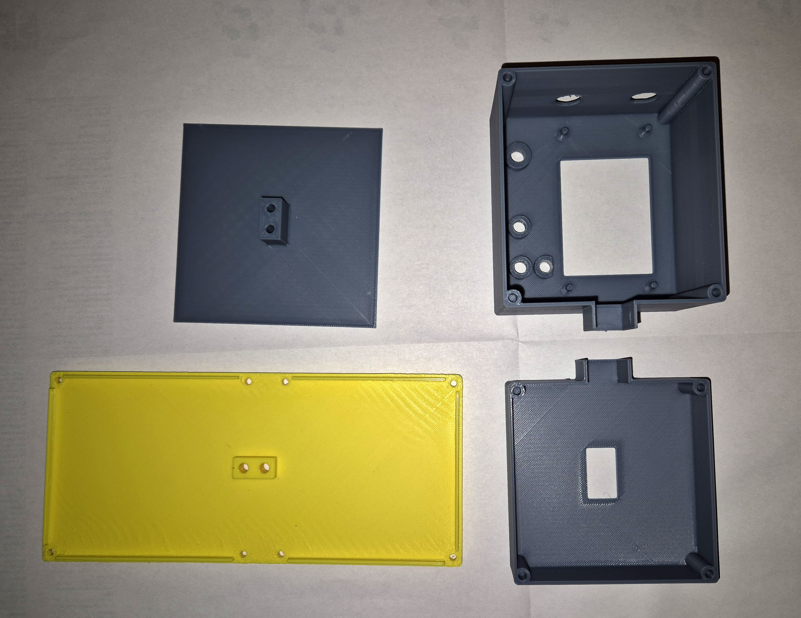
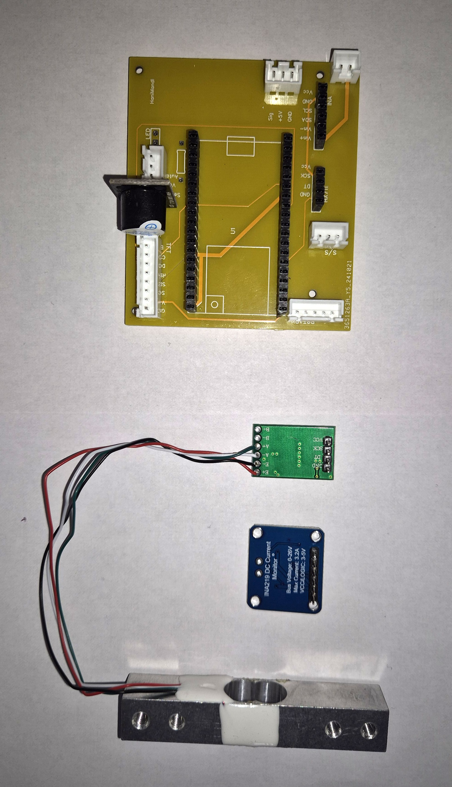
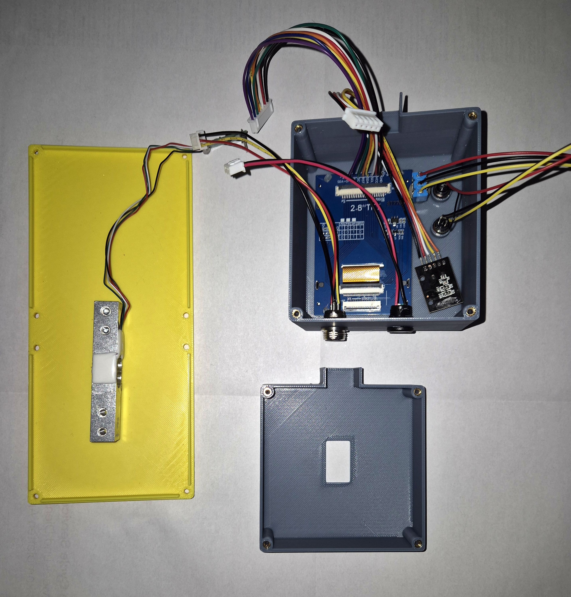
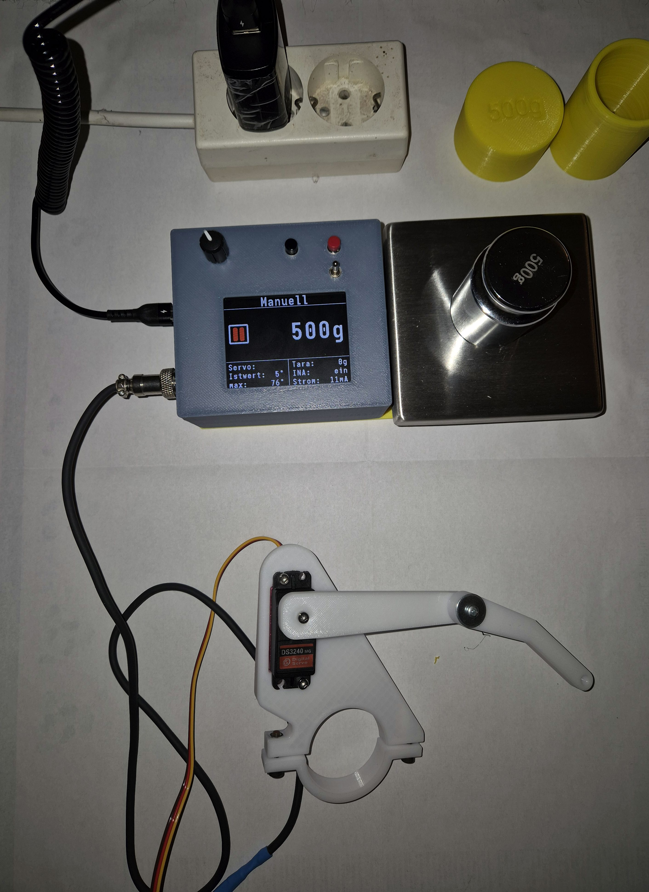

# HaniMandlWroom - Variante Karl
Herzlichen dank an Karl für die Bereitstellung der Daten :-)

# Bilder
## 1 Gehäuseteile 3D-Druck

## 2 Platinen

## 3 Verkabelungen

## 4 erster Funktionstest

## 5 fertig für die Basisplatine

## 6 Endabnahme

# Zaunpfostenkappen
Die Zaunpfostenkappe kann man kaugen unter:
https://www.hoerr-edelstahl.de/Gelaender-Zubehoer-Kleinteile/Stopfen-Kappen-Schalen-Ronden/Pyramidenkappen/Edelstahl-Zaunpfosten-Kappe-ZAUN-Pfosten-Adbeck-Kappe-10x10-cm-100x100-mm.html
