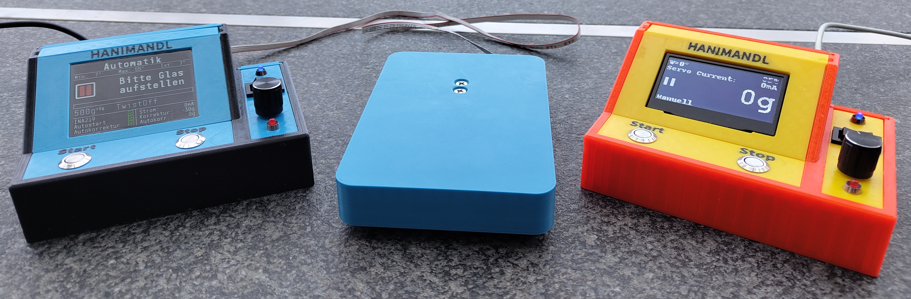
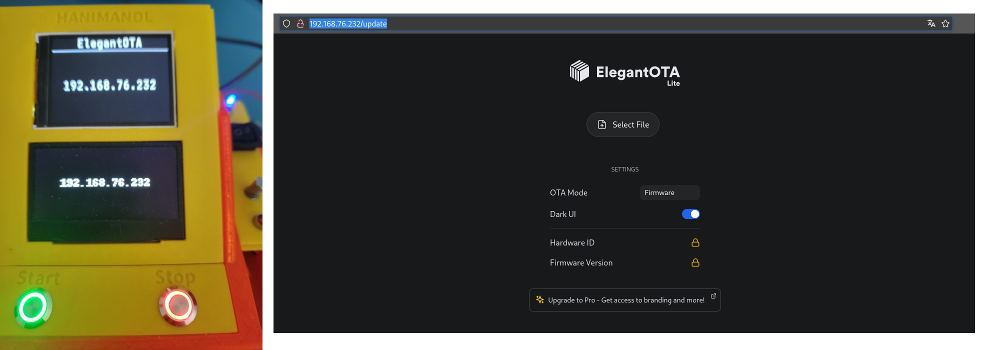

# HaniMandlWroom
HaniMandel für das Node MCU ESP32 38Pin Evaluation Board<br>



Dies ist eine abgeänderte Version von dem Orginal HaniMandl Projekt. Die Idee und Veröffentlichung wurde auf der Facebook-Gruppe ["Imkerei und Technik. Eigenbau"](https://www.facebook.com/groups/139671009967454) veröffentlicht.
Als Grundlage für dieses Projekt bediente ich mich am [develop Branch (V0.2.13)](https://github.com/ClemensGruber/hani-mandl/tree/develop) von Clemens Gruber.

## Einstellungen
```
//
// Usereinstellung
//
// Könnt ihr auf eins lassen. User 2 und User 3 haben andere Glaseinstellungen
//
#define USER 1                    // 1 = Hanimandl Standart (ist die Default Einstellung so wie Ihr es gewohnt seit)
                                  // 2 = Gerold (Wird bei euch nicht funktionieren, da die Logos fehlen im ResPos)
                                  // 3 = Roli

//
// Hier den Code auf die verwendete Hardware einstellen
//
#define HARDWARE_LEVEL 1          // 1 = ESP32-WROOM 38Pin Connector
                                  // 2 = Heltec WiFi Kit V3 use on board display (nur in Verbindung mit DISPLAY_TYP 1)
                                  // 3 = Heltec WiFi Kit V3 use extern display   (nur in Verbindung mit DISPLAY_TYP 1)
#define SCALE_TYP 2               // 1 = 2kg Wägezelle
                                  // 2 = 5kg Wägezelle
#define SERVO_ERWEITERT           // definieren, falls die Hardware mit dem alten Programmcode mit Poti aufgebaut wurde oder der Servo zu wenig fährt
                                  // Sonst bleibt der Servo in Stop-Position einige Grad offen! Nach dem Update erst prüfen!
#define ROTARY_SCALE 1            // in welchen Schritten springt unser Rotary Encoder. 
                                  // Beispiele: KY-040 = 2, HW-040 = 1, für Poti-Betrieb auf 1 setzen
#define DISPLAY_TYPE 3            // 1 = 128x64 pixel OLED Display angeschlossen über I2C
                                  // 2 = 128x64 pixel OLED Display angeschlossen über SPI (nicht für das Heltec Module)
                                  // 3 = 320x240 pixel TFT Display ST7789 angeschlossen über SPI (nicht für das Heltec Module)
                                  // 99 = Oled über I2C und TFT über SPI für development
#define OTA 1                     // 0 = OTA Uptade ausgeschalten
                                  // 1 = OTA Update eingeschalten
#define DREHTELLER 0              // 0 = kein Drehteller
                                  // 1 = Drehteller vorhanden
#define CHANGE_MAC_ADDRESS_HM 1   // 0 = behalte die Orginale Mac Adresse
                                  // 1 = Wechsle die Mac Adresse auf {0x74, 0x00, 0x00, 0x00, 0x00, 0x01}
#define CHANGE_MAC_ADDRESS_TT 1   // 0 = Mac Adresse vom Drehteller ist die orginale
                                  // 1 = Mac Adresse vom Drehteller wurde gewechselt auf {0x74, 0x00, 0x00, 0x00, 0x00, 0x02}
//#define FEHLERKORREKTUR_WAAGE   // falls Gewichtssprünge auftreten, können diese hier abgefangen werden
                                  // Achtung, kann den Wägeprozess verlangsamen. Vorher Hardware prüfen.
//#define QUETSCHHAHN_LINKS       // Servo invertieren, falls der Quetschhahn von links geöffnet wird. Mindestens ein Exemplar bekannt

//
// Ende Benutzereinstellungen!
// 
```

## OTA Update
Neu kann man auch über WLAN eine neue Firmware aufspielen.
Diese Funktion wurde mit Hilfe von ElegantOTA implementiert: https://github.com/ayushsharma82/ElegantOTA
```
#define OTA 1                     // 0 = OTA Uptade ausgeschalten
                                  // 1 = OTA Update eingeschalten
```
Die SSID und das Passwort wird in dem File ./src/Resources/wifi.h eingetragen.
Um das OTA zu aktivieren betätigt die Start Taste wärend Ihr im Setupmenü Hauptbildschirm seid. Danach verbindet sich der HM mit dem WLAN und wenn es klappt wird die IP-Adresse angeteigt.
Diese könnt Ihr nun an eurem Computer eingeben (z.B. http://192.168.76.232/update) und danach ein Beliebiges Binary File über den Browser flaschen.  



## Automatischer Volumenstrom beim Abfüllen
Unter Setup - Automatik kann neu ein Automatisch geregelter Volumenstrom eingestellt werden. Dies kan Hilfreich sein, wenn sehr flüssiger Honig abgefüllt wird.

## Bekannte Käferlein
Beim ersten Start ist der maximale Öffnungswinkel im Manuel und Automatik Betrieb auf 0. Dieser muss dann mit der Rotary eingestellt werden. Danach wird der Wert gespeichert. Ob das in der Alten Version auch schon so war, kann ich aus dem Kopf nicht sagen :-)

## Changelog
W.0.2
- OTA update implementiert
- Automatischer Volumenstrom beim Abfüllen implementiert (Nicht von mir getestet)
- Der HM kann nun auch über eine Sprachdatei die Menüsprache ändern (implementiert wurde bis jetzt Deutsch und Englisch)

W.0.3
- Die Sprache kann nun im Setup Menü ausgewählt werden (momentan Deutsch und Englisch. Ihr dürft gerne neue Sprachdateien machen und mir zukommen lassen)
- Funktion implementiert bei welcher man nach dem Tara das Glas wegnehmen kann und wider draufstellen mit eider Honigwabe oder sonstigem drin. (kann im Automatik Menü eingestellt werden)
- Hardware Level 2 und 3 hinzugefügt. Heltec Wifi Kit V3 (geht nur mit OLED Display)
- Drehteller Integriert

## Copyright

Die Software unterliegt dem gleichen Coryright und Anforderungen wie das Hauptprojekt.
Die Hardware (Gehäuse und PCB) sind von mir gemacht worden. Ich verzichte auf ein Copyriht für den Eigengebrauch. Auch wenn ich den Hanimandel nicht kommerziell vertreibe, gehören mir die Daten vom Gehäuse und PCB und diese dürfen nicht ohne meine Zustimmung kommerziell benützt werden.

## Benutzte Programme und Lizensen

Gehäuse: Ondsel/FreeCAD (keine Lizenz notwendig)<br>
PCB: DipTrace (kommerzielle Lizenz)
